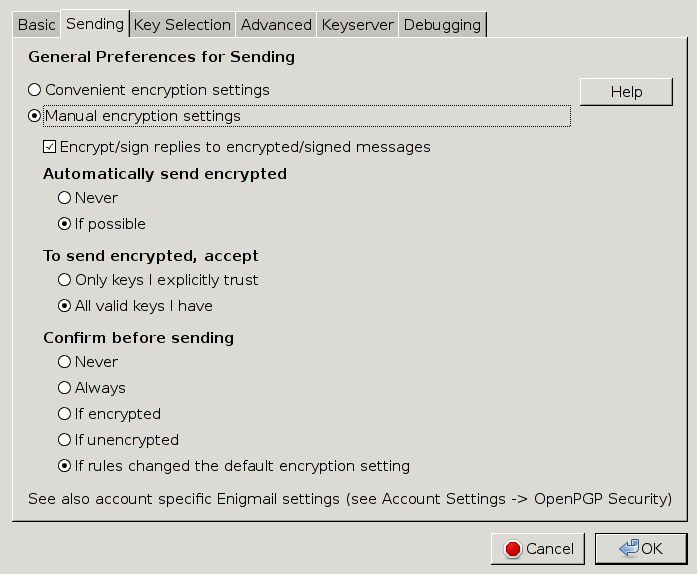
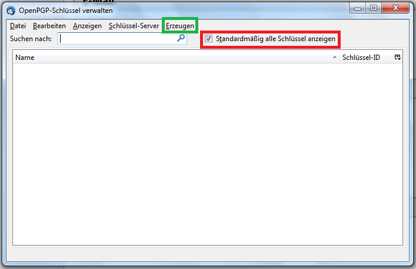
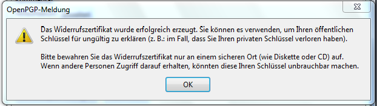
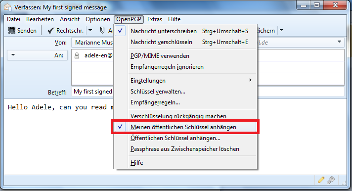
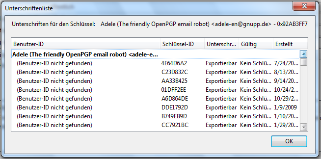

Email-Verschlüsselung mit GPG
=============================

Dieses Tutorial wird erklären wie (und warum) man Emails mit GPG (=GNU Privacy Guard,
eine freie Implementation von PGP=Pretty Good Privacy) verschlüsseln kann (und
sollte).

PGP ist wohl die ausgereifteste Lösung zur sicheren Kommunikation per Email und
auf allen gängigen Plattformen (GNU/Linux, Windows, Mac OS X, Android, iOS, ...),
verfügbar wenn auch vielleicht mit ein paar Haken auf die wir entsprechend hinweisen
werden.

Die Benutzung von GPG ist vorallem wenn man damit anfängt etwas obskur, weswegen
ich hoffe mit diesem Tutorial etwas Licht ins Dunkel zu bringen.

Im Folgenden werden PGP und GPG gleichwertig benutzt.

Alle Änderungwünsche und Vorschläge sende man mir per Email an [mich](mailto:behrmann@physik.fu-berlin.de).

# Warum Krypto?

## Warum eigentlich Krypto? Wer kann schon meine Mails lesen?

Dummerweise, jeder der sich auch nur ein bisschen bemüht. Emails sind nicht die
technische Fortführung des Briefes, für die man sie instinktiv hält, sondern
die der Postkarte.
Genau wie bei Postkarten, kann eine Email jeder lesen, bei dem sie vorbeikommt.
Das ist auch kein hypothetisches Angriffsszenario, das ist das Geschäftsmodell
von GMail, GMX, Yahoo und allen anderen Freemailern. Der Inhalt aller ein- und
ausgehenden Mails wird analysiert und daraus ein Profil der Nutzer erstellt, so
dass Werbung zielgerichteter geschaltet werden kann.

## Moment, meinen Webmailer besuche ich doch per HTTPS und auch in meinem Mailprogramm habe ich SSL/TLS eingeschaltet.

Sehr gut, nur leider ist das nur ein Tropfen auf den heißen Stein. Erstmal
bedeutet das nur, dass die Kommunikation zwischen dir und deinem Mailserver
verschlüsselt ist, über die Kommunikation zwischen den Mailserver verschiedener
Anbieter sagt das leider erstmal nichts aus. Diese war bis vor kurzem meist
unverschlüsselt und das hebelt die Verschlüsselung insgesamt aus, da diese immer
nur so stark ist, wie ihr schwächstes Glied.

Auch schützt einen SSL/TLS nicht vor Fehlern in dessen Implementierung, wie
jüngst Heartbleed zeigte, oder seinem Design, z.B. kann prinzipiell jede CA
(Certificate Authority) für jeden Host ein SSL-Zertifikat ausstellen.
SSL hat zu viele mögliche Angriffe gegen sich, um sie hier aufzuzählen, nicht
zuletzt, dass zumindest bei nicht selbst betriebenen Mailservern immer staatliche
Stellen die Herausgabe der Schlüssel verlangen können.

Zwar gibt es Lösungsansätze für all diese Probleme: Perfect Forward Secrecy
ermöglicht, dass erbeutete SSL-Schlüssel nicht dazu genutzt werden können
zurückliegenden Datenverkehr zu entschlüsseln, DANE löst das Problem, das einem
falsche Schlüssel untergeschoben werden. Allerdings werden diese Lösungen noch
nicht überall unterstützt, DANE z.B. erst von einem *einzigen* Mailprovider
überhaupt (Posteo).

Selbst wenn man selbst oder der eigene Mailanbieter das Minenfeld SSL sicher
durchschifft hat, bleibt das Problem, dass SSL die Daten nur im Transit schützt,
nicht aber, wenn sie einmal auf dem Server liegen. Dort kann die Mail jeder lesen,
der Anbieter und seine Admins und jeder sonst, der Zugang zu den Mailservern hat,
z.B. Techniker im Datacenter.

PGP löst diese Problem auf allen Ebenen, da nur der Besitzer des richtigen Schlüssels
eine Mail entschlüsseln kann.

## Und selbst wenn, ich habe doch nichts zu verbergen.

Diesen Satz höre ich immer wieder und er könnte kaum falscher sein: Jeder hat Dinge
zu verbergen.

Schlussendlich ist es nichteinmal notwendig, dass man selbst etwas zu verbergen
hat. Die Enthüllungen Edward Snowdens haben gezeigt, dass die NSA die Verbindungen
zwischen Menschen bis in eine Tiefe von 3 untersucht, das bedeutet:

> A kennt B kennt C kennt D

Folglich kann auf A zurückfallen, dass er jemanden kennt, der jemanden kennt, der
jemanden kennt, der verdächtig ist. Kennst du alle Freunde von Freunden deiner
Freunde? Kannst du für alles Einstehen, was sie sagen, tun und denken?
Unwahrscheinlich, wenn man bedenkt, dass der soziale Graph für die gesamte
Menschhehit nur einen Durchmesser von 5 oder 6 haben soll, also nur noch zwei
oder drei Verbindungen mehr.

Zwar wurde Seitens der US-Amerikanischen Regierung versichert, diese Untersuchungen in
Zukunft auf eine Tiefe von 2 zu beschränken, in wieweit diese Aussage aber vertrauenswürdig
ist, sei an dieser Stelle als Hausaufgabe gelassen.

## Sonst noch was?

Außer zur Verschlüsselung, erfüllt PGP noch einen anderen Hauptnutzen: Authentifizierung.

Woher weis ich eigentlich, das Mails von meinem Kumpel auch von ihm kommen, oder
wichtiger, Mails von meiner Bank?

Ich weis es nicht, da Absender von Mails trivial zu fälschen sind. Warum? Mails sind
einfache Textdateien, der Absender
ist einfach ein Eintrag
```
From: user@host.com
```
Würde ich eine Mail fälschen wollen, dann könnte ich ganz einfach irgendetwas
in das From-Feld eintragen.

Dieses Problem wird durch digitale Signaturen gelöst. Dabei wird eine Zusammenfassung
(Digest) an die Mail angehangen, der vom Sender mit seinem Schlüssel verschlüsselt
ist, und der vom Empfänger entschlüsselt und gegen einen selbstangefertigten
Digest verglichen werden kann. Sind beide Digests gleich, weis man, dass die Mail
nicht manipuliert wurde und von demjenigen geschickt worden sein muss, der den
Schlüssel besitzt mit dessen Hilfe der Digest erstellt wurde.

## Und wo ist der Haken?

## Ein paar Worte dazu wie Krypto funktioniert

# Mein erster Tag mit GPG

Im Folgenden gehen wir gemeinsam reich bebildert durch die Instllation und
Konfiguration von Thunderbird und GPG. Da (leider) die meisten Leute Windows
benutzen, habe ich ein aktuelles Windows 7 als Beispielsystem genommen auf das
ich das aktuelle [Thunderbird 24.5.0](https://www.mozilla.org/en-US/thunderbird/)
installiert habe. Für unser eigentliches Ziel, die Email-Krypto mit PGP, kommt
dazu noch [GPG4Win](http://www.gpg4win.org/) und [Enigmail](https://www.enigmail.net/home/index.php).

Unter allen gängigen Linux-Distributionen ist alles etwas einfacher, da man im
Zweifel nur Thunderbird installieren muss, da alle großen Distributionen GPG
schon in der Form von [GNUPG](https://www.gnupg.org/) mitbringen.

Unter Mac OS X ist eigentlich auch alles mehr oder weniger einfach, dort ist
die GPG Suite die man haben möchte [GPGTools](https://gpgtools.org/). Allerdings
sind meine Aussagen zu Mac OS mit Vorsicht zu genießen, da ich keinen Mac habe
um sie zu testen, folglich übernehme ich, wie auch für alle anderen Aussagen,
keine Gewähr.

Ich werde das Tutorial für eine fiktive Nutzerin mit dem Namen Marianne Mustermann
schreiben und einmal durch alle wichtigen Einstellungen von Thunderbird gehen.

## Thunderbird installieren und konfigurieren

Als erstes installieren wir [Thunderbird](https://www.mozilla.org/en-US/thunderbird/).
Beim ersten öffnen, solltet ungefähr soetwas sehen:


Da ihr von eurer Uni eine funktionierende Mailadresse bekommen habt oder schon eine
habt, ist `Überspringen und meine existierende E-Mail-Adresse verwenden` die
richtige Wahl.

Das führt euch zum folgenden Fenster:


In diesem Fenster könnte ihr euren Namen und eure Mailadresse eintragen, sowie
das Passwort für den Mailsever, wenn ihr wollte, könnt ihr euer Passwort auch
sprechen.

Aus dem Hostname der Mailadresse kann Thunderbird die Einstellungen des Mailserver
bestimmen, für den Fall, dass die Einstellungen eures Mailservers nicht in
Thunderbirds Datenbank sind, könnt ihr Protokoll (IMAP oder POP3 für den
Posteingangsserver), Hostname von IMAP- und SMTP-Server, ihre Ports, die SSL-Einstellungen
und die Art der Authentifizierung sowie euren Usernamen für den Mailserver
einstellen

Hier eine Liste von Beispieleinstellungen für ein paar Unis, für den unwahrscheinlichen
Fall, dass eure Uni nicht in der Datenbank von Thunderbird ist:

Uni | Anleitung
----|----------
RWTH Aachen | https://doc.itc.rwth-aachen.de/display/EML/Thunderbird+14+bis+Thunderbird+24
FU Berlin | http://www.zedat.fu-berlin.de/tip4u_91.pdf
HU Berlin | http://www.cms.hu-berlin.de/dl/kommunikation/email/clients/Thunderbird301/
TU Berlin | https://www.tubit.tu-berlin.de/menue/dienste/kommunikation_internet/e-mail/der_e-mail_service/daten_und_anleitungen/einrichtung_in_thunderbird/
KIT       | https://www.scc.kit.edu/dienste/7395.php
LMU München | http://www.en.it.physik.uni-muenchen.de/dienste/kommunikation/e-mail/einrichtung_clients/index.html
TU München  | https://portal.mytum.de/faq/it-dienste/email2/imap
Universität Potsdam | http://www.zeik.uni-potsdam.de/internet/mail.html

Ein Kommentar zu den Einstellungen: IMAP ist auf jeden Fall vor POP3 zu bevorzugen.
Bei IMAP liegen eure Mails dauerhaft auf dem Mailserver, mit POP3 werden sie vom,
Mailserver heruntergeladen und verschwinden von dort.

Beides hat Vor- und Nachteile. Zwar liegen bei IMAP eure Mails auf einem Server,
aber dafür liegen eure Mails auf einem Server. Das ist nicht nur ein gutes Backup,
sondern ermöglicht auch eure Mails zwischen mehreren Clients synchron zu halten
und Smartphones und Tablets sei Dank hat heute jeder mehrere Clients.

Viel wichtiger ist jedoch, dass POP3 nur für einseitge Kommunikation von Server
zu Client gedacht ist, dadurch kann es zu mehrmaligen Herunterladen von Mails oder
dem Verlust von Mails kommen. IMAP hingegen ist für Zwei-Wege-Kommunikation zwischen
Server und Clients und hält den Zustand aller Mails und Ordner in eurer Mailbox
synchron.

Bei der Authentifizierung gibt es viel Auswahl, aber `Automatisch erkennen` oder
`Normales Passwort` ist die beste Wahl, vorausgesetzt dass ihr SSL eingeschaltet
habt, was ihr *unbedingt* tun solltet, dabei ist STARTTLS SSL/TLS falls möglich
vorzuziehen, da STARTTLS explizit TLS als Transportverschlüsselung verlangt und
SSL/TLS auch SSL nehmen könnte. Warum ist das wichtig? TLS ist die spätere Version
des SSL-Protokolls und sicherer. Warum ist `Normales Passwort` sicher, warum nicht
`Verschlüsselts Passwort`? Ganz einfach, mit Hilfe von TLS ist die übertragung des
Paswortes schon verschlüsselt, während die Übertragung eines verschlüsselten Passwortes
für den früher normalen Fall von unverschlüsselten Verbindungen zwischen Mailserver
und Client gedacht war.

Das Fenster zur Konteneinrichtung ist leider etwas buggy. Zwar kann man die Ports
zwischen ein paar Voreinstellungen wechseln, leider ist die Transportverschlüsselung
immer fest an den Port gebunden, was in der Realität natürlich nicht so sein muss.
Auch kann man die auf `Erweiterte Einstellungen`, was einen direkt zu den Konteneinstellungen
bringt wo man unter `Server-Einstellungen` und `Postausgang-Server (SMTP)` alles
von Hand einstellen kann, erst klicken, nachdem man wirklich alle Felder in diesem
Fenster von Hand verändert hat.

Wenn ihr im Konteneinrichtungsfenster alles eingegeben habt, dann habt ihr es geschafft und
Thunderbird so weit eingerichtet, das ihr es benutzen könnt. Ihr solltet jetzt
folgendes sehen können (zumindest wenn ihr Alt drückt um die Menüleiste anzuzeigen).


Falls ihr das obere Fenster so nicht sehen könnt, dann müsst ihr auf das entsprechende
Mailkonto klicken, was in obigen Bild rot eingerahmt ist.

Als nächstes wollen wir die wichtigsten Optionen von Thunderbird bearbeiten.
Leider sind diese über die Konten-Einstellungen und die globalen Einstellungen
von Thunderbird verstreut. Wir werden mit den Konteneinstellungen anfangen, diese
sind im obigen Bild grün eingerahmt.

Als erstes solltet ihr die Startseite der Konten-Einstellungen sehen.


Hier könnt ihr sowohl den Namen als auch die E-Mail-Adresse des Kontos ändern oder
eine Signatur hinzufügen. Außerdem könnt ihr hier im rot eingerahmten Feld weitere
Identitäten einfügen, die ihr dann als Absender für eure Mails benutzen könnt.


Wir bearbeiten einfach mal die beispielhaft die Default-Identität, die beim Einrichten
von Thunderbird erstellt wurde:


Während die Konteneinstellungen die `globalen` Einstellungen des Kontos beinhaltet,
kann man diese Einstellungen benutzen um für jeden einzelen Alias spezifische Einstellungen
für Namen und Emailadresse zu machen und am aller wichtigsten für das
`Verfassen & Adressieren` (rot eingerahmt):


Das ist der richtige Moment um etwas über Mail-Etiquette zu reden:

1. Schaltet HTML-Mails aus (rot eingerahmt). HTML-Mails sind eine furchtbare Pest
   und seid ehrlich, wann habt ihr das letzte Mal den Font eurer Mail geändert
   oder den Text in Regenbogenfarben gestaltet? Nie? Richtig.
   Dafür erschwert HTML die Anzeige auf einfachen textbasierten Clients und
   macht die Verschlüsselung mittels GPG schwieriger.
   Solltet ihr jemals HTML-Mails versenden wollen, dann kann man sie einfach durch
   das Drücken von Shift beim Anklicken von `Verfassen` für die gerade aktuelle Mail
   anschalten.

2. Antworten auf Mails beginnt man überlicherweise *über* zitierten Texten (blau
   eingerahmt). Niemand möchte bei jeder Mail ganz nach unten scrollen müssen.

Die selben Einstellungen kann man auch nochmal für alle Aliase eines Kontos unter
`Verfassen & Adressieren` in den Konteneinstellungen machen:


Von hier aus gehen wir direkt in die globalen Einstellungen (grün eingerahmt):


Hierher kommt man alternativ auch über das Menü über Extras -> Einstellungen.
Wir interessieren uns vornehmlich für die Reiter `Verfassen` und `Sicherheit`,
rot und grün eingerahmt. Fangen wir mit der Sicherheit an:


Als erstes sollte man ein Master-Passwort setzen, da Thunderbird ansonsten alle
Passwörter im Klartext speichert und bei einem einfachen Klick auf das Feld
`Gespeicherte Passwörter` anzeigt.

Unter `Verfassen` finden wir folgendes:


Die `Sende-Optionen` sind was uns interessiert. Dort kann man sehr kleinteilig
einstellen an welche Adressen man HTML- und an welche man Reintext-Mails schicken
möchte.


Da wir natürlich nur Reintext-Mails schicken wollen, setzen wir dort über hinzufügen
die Expression \*.\* als Wildcard um alle Namen für Domains auf einmal zu erfassen.
Natürlich gilt immer die oben genannte Ausnahme (Shift beim Klicken von Verfassen)
falls man doch wirklich mal eine HTML-Mail verschicken wollen sollte.

Jetzt haben wir es geschafft. Wir sind mit den grundlegenden Einstellungen von
Thunderbird fertig.

# Krypto!

## GPG installieren und Vorbereitungen

Um jetzt zur Krypto zu kommen, müssen wir erstmal GPG installieren. Unter Windows
läd man sich dafür [GPG4Win](http://www.gpg4win.org/) herunter und installiert es.
Unter Linux ist das ganze etwas einfacher, denn GPG wird von allen großen Distribution
zur Signierung ihrer Pakete verwendet und ist deswegen schon installiert.
Unter Mac OS X muss man zu [GPGTools](https://gpgtools.org/) greifen.

Nachdem wir GPG4Win (oder Äquivalent) installiert haben, installieren wir nun Enigmail.
Enigmail ist das Addon das Thunderbird als Wrapper für GPG benutzt. Dafür gehen
wir unter Extras im Hauptmenü in das Add-on Menü und suchen nach Enigmail,
installieren es und starten anschließen Thunderbird neu.


Nach dem Neustart sollte dieses Fenster aufpoppen:


Dieser kann eigentlich alle Einstellungen zu machen, die wir gleich machen wollen.
Leider hatte er (zumindest in der Vergangenheit) ein paar Beschränkungen, z.B.
in der Schlüssellänge, so dass wir lieber alles von Hand machen, was auch den
Vorteil hat, dass wir die Einstellungen kennenlernen.

Wenn ihr nun Alt drückt, dann seht ihr, dass ein neues Menu zu den bisherigen
hinzugekommen ist:


Über das OpenPGP-Menu oben findet ihr die Einstellungen:


Die Einstellungen sind aber offensichtlich etwas leer, weswegen wir erstmal die
restlichen Einstellungen anschalten (rot eingerahmt), dadurch kommen einige
Reiter dazu:


Auf diesem Reiter ist die Zeit für die Speicherung der Passphrase am inetessantesten.
Was ist die Passphrase eigentlich? Wenn wir nachher einen Schlüssel erstellen,
dann werden wir ihn mit einer Passphrase sichern, damit unser Schlüssel auch nur
von uns benutzt werden kann. Die Passphrase muss man dann für jedes Senden oder
Entschlüsseln einer Mail neu eingeben, da das aber etwas unkomfortabel sein kann,
kann man die Passphrase für ein paar Minuten zwischenspeichern; gute Werte dafür
sind alles zwischen einer und fünf Minuten.

So, gehen wir zum nächsten Reiter `Senden`:



Was wir hier sehen, sind die Standardeinstellungen, wichtig sind hier die beiden
eingerahmten Einstellungen.

Das rot eingerahmte bedeutet, dass immer wenn ihr eine verschlüsselte Mail
verschickt, der Text nicht nur fúr den Empfängerschlüssel, sondern auch für euren
eigenen verschlüsselt wird.

Wie wir oben schon genauer beschrieben haben, kann ein Text, der mit einem
öffentlichen Schlüssel verschlüsselt wurde, nur mit dem zugehörigen privaten
Schlüssel wieder entschlüsselt werden. Folglich könntet ihr nach der
Verschlüsselung ohne Nutzung dieser Option eure von euch selbst verschickten
Mails nicht mehr lesen.

Die grüne Option dreht sich auch um Verschlüsselung. Wenn diese Option nicht gesetzt
ist, dann könnte ihr verschlüsselte Mails nur an andere PGP-Nutzer schicken, deren
Schlüsseln ihr vertraut, was bedeutet, dass ihr sie unterschrieben habt (mehr
dauz spẗer). Durch das Setzen dieser Option könnt ihr jemanden eine verschlüsselte
Mail schicken ohne vorher seinen Schlüssel zu signieren.

Der nächste Reiter dreht sich um die Auswahl von Schlüsseln:


Die Voreinstellung ist die beste Wahl, dadurch wird immer automatisch der passende
Schlüssel zu einer Mailadresse gewählt und alles lässt sich durch Empfängerregeln,
zu denen wir später noch mehr sagen, noch genauer einstellen.

Die erweiterten Einstellungen haben in der Standardeinstellung folgende Häkchen:


Die meisten Einstellungen sind relativ selbsterklärend.
Die ersten Option regelt das automatische signierte/verschlüsselte Antworten auf
signierte/verschlüsselte Mails, und die zweite fügt in alle Mails einen zusätzlichen
Header ein, der anzeigt, dass man Enigmail benutzt. Wenn man das nicht möchte kann man
das getrost abschalten.

Zu guter letzt die Liste der Schlüssel-Server:


Wie findet man bei PGP eigentlich die Schlüssel anderer Leute, wenn man sie nicht
von ihnen bekommen hat? Man sucht auf einem Schlüsselserver. Schlüsselserver sind
soetwas wie ein Telefonbuch für PGP-Schlüssel. Wenn man nach einem Schlüssel sucht
dann hat man in Zukunft die Auswahl zwischen allen Server in dieser Liste.

Der wichtigste Server ist `pool.sks-keyservers.net`. Dieser ist kein einzelner
Server, sondern ein Pool mehrer Server die alle Schlüssel zwischen sich austauschen,
wodurch sie insgesamt am aktuellsten sind. Ein weiterer großer Server, der auch
Teil des SKS-Pools ist, ist `pgp.mit.edu`.

So, nachdem wir nun durch die allgemeinen PGP-Einstellungen durch sind, kommen wir
zum interessante Teil des Abends: Wir machen uns einen Schlüssel und benutzen ihn.

## Den Schlüssel erstellen

Um einen Schlüssel zu machen müssen wir in die Schlüsselverwaltung gehen:


Beim Klicken auf das rot eingerahmte Feld klickt, öffnet sich die Schlüsselverwaltung



Als erstes sollten wir das Häkchen bei `Standardmäßig alle Schlüssel anzeigen`
setzen, damit wir auch immer alle Schlüssel sehen, aber was uns am meisten interessiert
ist das Erzeugen-Menu:


Unter Benutzer-ID kann man wählen für welchen Alias man einen Schlüssel erzugen
will. Da keine Passphrase zu setzen leichtsinnig ist, setzen wir eine Passphrase;
am besten mit mehr mehr als acht Zeichen.

Der erste Punkt der etwas genauer überdacht werden muss, ist die Gültigkeit des
Schlüssels. Prinzipiell ist es sinnvoll seinen Schlüssel nach einer gewissen Zeit
zu wechseln, aber eine endliche Laufzeit kann das Problem haben, dass man sie vergisst
und dann nach ein paar Jahren ohne Schlüssel dasteht. Ein Schlüssel mit beliebiger
Laufzeit verleitet aber auch dazu ihn beliebig lange zu nutzen. Das hier ist eine
Frage die man für sich selbst klären muss.

Der deutlich wichtigere Reiter in diesem Fenster ist aber `Erweitert`


In diesem Menü können die Schlüsselstärke (seine Länge) und der Schlüsselalgorithmus
gewechselt werden.

Bei den Algorithmen besteht die Wahl zwischen RSA, dem als schwieriges Problem
Faktorierung zu Grunde liegt, und DSA & ElGamal, das auf dem schwierigen Problem
des diskreten Logarithmus basiert. Ich empfehle RSA zu benutzen, da es ein sehr
ausgereifter und sicherer Algorithmus, der von der Mehrheit benutzt wird.

Die Schlüssellänge sollte man auf 4096 Bit stellen, da es heutzutage keine so
schwache Hardware mehr gibt, dass sich kürzere Schlüssel lohnen. Die Standard-Schlüssellänge
von 2048 Bit ist auch noch ok, 1024 bittige Schlüssel sollten aber als unsicher angesehen
werden.

Ein Klick auf auf `Schlüsselpaar erzeugen` tut genau das und nach einer Weile ist
das Schlüsselpaar fertig und dieses Fenster grüßt uns:


Dieses Fenster befragt uns ob wir ein Widerrufszertifikat erzeugen wollen. Diese
Zertifikate können dazu benutzt werden aller Welt zu sagen, das man den eigenen
Schlüssel nicht mehr benutzen möchte (man hat einen neuen oder der alte wurde gestohlen).
Dafür kann man das Zertifikat einfach auf einen Schlüsselserver hochladen auf den
man vorher schon seinen öffentlichen Schlüssel hochgeladen hatte, dieser wird dann
als widerrufen markiert.

Man sollte also für den Fall der Fälle ein Widerrufszertifikat erzeugen und es
an einem *sicheren Ort, offline* speichern, weil ansonsten jemand, der in Besitz
des Zertifikates gerät, unseren Schlüssel widerrufen könnte.

Wenn man auf `Zertifikat erzeugen` klickt, öffnet sich diese Fenster


und fragt nach unserer Passphrase. Gewöhnt euch an dieses Fenster, ihr werdet es
von nun an häufiger sehen. Nach Eingabe der Passphrase wird das Zertfikat erzeugt



und wir sehen nun unseren Schlüssel in der Schlüsselverwaltung


## Was man über den Schlüssel wissen und was man mit ihm tun kann

Wie haben jetzt also einen Schlüssel, was können wir damit tun? Wir können jetzt
unsere Mails signieren und Leute können uns verschlüsselte Mails schicken;
vorausgesetzt sie haben unseren Schlüssel. Wie kommen andere Leute nun an unseren
Schlüssel? Über die bereits erwähnten Keyserver, die wie Telefonbücher für
PGP-Schlüssel sind.

Durch das Hochladen eines Keys auf den Keyserver veröffentlicht man seinen öffentlichen
Schlüssel (und nur diesen) mit allen damit verbundenen Informationen:

1. Schlüssel-ID
2. Alle Benutzerinformationen des Schlüssels (Namen, Emailadressen)
3. Nutzerfoto (wenn man eines an den Schlüsselangehangen hat)

Der erste der Punkte ist noch harmlos, aber zweiter und dritter Punkt sind Informationen,
die vielleicht nicht jeder preisgeben möchte, vorallem in Anbetracht dessen, das ein
Schlüssel der einmal im Netz war nie wieder zurückgeholt werden kann, auch nicht
durch Widerruf.

Gleichzeitig macht man es anderen Leuten bedeutend schwerer mit einem verschlüsselt
zu kommunizieren oder die eigenen Signaturen zu überprüfen, wenn man seinen öffentlichen
Schlüssel nicht möglicht breit veröffentlicht.

Schlussendlich muss man selbst entscheiden, wie man seine Schlüssel handlen will
und wie viel Informationen man an sie dranhängt (z.B. hängt fast niemand ein Foto an),
ich würde die Benutzung von Keyservern jedoch empfehlen.


Wie läd man seinen Schlüssel nun auf einen Keyserver? Durch Klicken auf
`Auf Schlüssel-Server hochladen...` was oben grün eingerahmt ist. Wenn man die
Schlüssel anderer Leute hat kann man diese auch mittels `Von Schlüssel-Server aktualisieren...`
updaten um zu sehen ob der Nutzer neue Benutzer-IDs hinzugefügt hat, neue Signaturen
hat oder der Schlüssel vielleicht widerrufen wurde.

Wir werden unseren Schlüssel jetzt nicht auf einen Keyserver laden, da kein Mensch
zu diesem Schlüssel existiert, müssen wir die Keyserver auch nicht vollmüllen.

Wie kann ich sehen, was für Informationen an meinem Schlüssel hängen? Ganz einfach,
inde man auf `Schlüsseleigenschaften` klickt, was im obigen Bild rot eingerahmt ist.

Nach dem Klick taucht das Fenster mit den Schlüsseleigenschaften auf:


Was sehen wir hier? Als aller erstes sehen wir die `Primäre Benutzer-ID`, was derzeit
die ist, für die wir den Schlüssel erstellt haben. Darauf folgt die Schlüssel-ID
eine in hexadezimal geschriebene (leider nicht notwendig eindeutige, aber fast eindeutige)
Zahl, die als kurze Identifikation eures Schlüssels dient.

Das nächste ist der Typ des Schlüssels, der in diesem Fall `Schlüsselpaar` ist,
weil wir sowohl im Besitz des öffentlichen als auch des privaten Schlüssels sind.
Hätten wir nur den öffentlichen Schlüssel, dann würde dort `öffentlich` stehen.

Die Schlüsselgültigkeit sagt aus wie sehr ihr *diesem Schlüssel* vertraut, also
z.B. gar nicht (der Wert dafür ist *unbekannt*) oder doch (falls ihr den Schlüssel
unterschrieben habt) oder *absolut* falls er euch gehört oder *Widerrufen* falls er
das ist.

Das Besitzervertrauen gibt an wie sehr ihr *dem Besitzer des Schlüssels* vertraut,
genauer seiner Fähigkeit die Identität anderer Leute zu überprüfen, was dann wichtig
wird wenn es darum geht ob wir den Schlüsseln anderer Leute vertrauen, aber dazu
später mehr.

Der Fingerabdruck zu guter Letzt ist eine sehr lange hexadezimale Zahl, ein Hash,
der unseren Schlüssel identifiziert. Ein genauerer Blick zeigt uns, dass die Schlüssel-ID
die letzten acht Zeichen des Fingerabdrucks sind.

Darüber hinaus sehen wir noch die Liste der weiteren Benutzer-IDs, von denen wir
derzeit keine haben, und die Liste der Schlüsselteile. Was sind Schlüsselteile?
Zu sagen, das ein Schlüsselpaar nur ein ein öffentlicher und ein privater Schlüssel
sind, ist eine, wie Terry Pratchet es nennen würde, "Lie to Children" um die Realität
begreifbar zu machen. Die Wahrheit ist, das ein Schlüsselpaar mehrere Schlüssel,
sogenannte Subkeys für verschiedene Aufgaben vorhält. Dazu vielleicht in einer
späteren Version dieses Tutorials mehr.

Fügen wir doch jetzt aber erstmal noch eine Benutzer-ID hinzug. Dafür klicken wir
auf `Aktion wählen...`


und dort auf `Benutzer-IDs verwalten...`, woraufhin wir mit einem Fenster begrüßt
werden, das strukturell schon wie das der Thunderbirds-Identitätsverwaltung aussieht,
die wir weiter oben schon beschrieben haben.


Sie funktioniert auch ähnlich, nur das wir nach ausfüllen des Hinzufügen-Fensters


noch einmal unsere Passphrase eingeben müssen, woraufhin wir fertig sind:


Die neue Benutzer-ID erscheint nun auch in der Liste in den Schlüsseleigenschaften.


Um die neue Benutzer-ID auch zu benutzen, muss man allerdings noch eine entsprechende
Identität mit der Identitätverwaltung anlegen.

## Mails signieren und verschlüsseln

Kommen wir nun endlich zum Herzstück der ganzen Aktion dem signieren und dem
Verschlüsseln.

Bevor wir damit anfangen, brauchen wir jedoch einen Kommunikationspartner, der
weis, wie man mit PGP umgeht, aber woher nehmen?

Zu unserer Rettung kommt Adele, der freundlichen E-Mail-Roboter. Adele nimmt
Mails mit öffentlichen Schlüsseln an und antwortet einem verschlüsselt auf diese.

Gehen wir also zurück zur Schlüsselverwaltung und klicken auf `Schlüssel suchen...`


Nach Eingabe des Suchbegriffes `Adele` bekommen wir mehrere Auswahlen von der wir
die erste wählen


Nachdem wir `Ok` klicken kommt die Meldung, das wir Adeles Schlüssel erfolgreich
importiert haben:


Also los, verschicken wir usnere erste signierte Nachricht:


In der unteren rechten Ecke (rot umrandet) des Verfassen-Fensters koennen wir sehen,
das wir die Mail signieren wollen (das Bleistift-Icon ist golden unterlegt), aber nicht
verschlüsseln (das Schlüsselsymbol ist ausgegraut). Beides kann durch einfaches
Klicken auf die Symbole gewechselt werden.

Woher kennt Adele unseren öffentlichen Schlüssel? Sie kennt ihn nicht, aus diesem
Grund hängen wir ihn an:



Danach klicken wir auf `Senden` woraufhin wir von diesem Fenster begrüßt werden,
da Anhänge in PGP auf zwei verschiedene Arten behandelt werden können, dazu später
mehr. Erstmal entscheiden wir uns für diese:


Wie sieht unsere signierte Nachricht nun aus? Sie sieht so aus:


Enigmail unterdrückt (fast) alle PGP-eigenen Nachrichten, so wie alle Mailclients
und Webmailer schon fast allen Inhalt einer Mail unterdrücken. Schauen wir uns doch
mal den Rohtext der Mail an:

```
Message-ID: <537F8379.50609@bhaal.de>
Date: Fri, 23 May 2014 19:20:57 +0200
From: Marianne Mustermann <mustermann@bhaal.de>
User-Agent: Mozilla/5.0 (Windows NT 6.1; WOW64; rv:24.0) Gecko/20100101 Thunderbird/24.5.0
MIME-Version: 1.0
To: adele-en@gnupp.de
Subject: My first signed message
X-Enigmail-Version: 1.6
Content-Type: multipart/signed; micalg=pgp-sha1;
 protocol="application/pgp-signature";
 boundary="NuT79Xx3vG1x8KSdDAqkK5OE0wwg4WvVO"

This is an OpenPGP/MIME signed message (RFC 4880 and 3156)
--NuT79Xx3vG1x8KSdDAqkK5OE0wwg4WvVO
Content-Type: multipart/mixed;
 boundary="------------030906060204070401060401"

This is a multi-part message in MIME format.
--------------030906060204070401060401
Content-Type: text/plain; charset=ISO-8859-15
Content-Transfer-Encoding: quoted-printable

Hello Adele, can you read my message?

--------------030906060204070401060401
Content-Type: application/pgp-keys;
 name="0xEC16A061.asc"
Content-Transfer-Encoding: quoted-printable
Content-Disposition: attachment;
 filename="0xEC16A061.asc"

-----BEGIN PGP PUBLIC KEY BLOCK-----
Version: GnuPG v2.0.22 (MingW32)

mQINBFN8+hkBEADGk2ojE5KM2JRW+kD768e+X5+pRQ/bUl/H2UDTeRb6hYLNCRB4
ASFgQltZbSI5y+kVOt5ecbXE0pUL3Npj/tP5UBO9a9KM2NMyY2/bmCqOas7U1oda
iomNcI2Qzw3B0T0HBspHl5exOv/Qqc35+osM9ey3+Wh0z/TyiqugT7Sp68Fh2m5X
PJC7CD0+V2USbmqBy+zLLSmacO+u8RTx/kFT8dU3yGoebeI9+6adlAARA6hyQyyL
uSym84DBK6NgcnonhPQxOjlZKlSeBueiroKmc6iFDd0msaYnFRtxhRX6/lienttR
kPt3xmXvIL6veTY0Ra/zvj3awc7bR+UuuKIx0g73nffeAYugNTSz01F7waMivQiE
lumsqNW6t/uGMzgTDoFKIPYTK6hAh8Tnaw1RGAYMhsOhgmlA4zpOXStfBJxusDUZ
t06iN9vHGTxYv28BEf/CmI5GLd2GANsPtXeqtGth5hKx2KKtOQ/W2DFUmGGz8rAT
o8pTC/Ub4qHgvgf1TQ7DZA65v6V21IGeUSAWLDLm00TTBrlF/iz8PuXdhKPWwVT6
kj84aFbNampVCcGon292PmiGu3rjpcYt0liLpcy6TMQLKqbl1sCwE5t8L2Ohq0EN
sgkgNoYPdNA7O1YrZXk9xu8Hr72raTOmE1+Y3IiWWwuDiOpT88oA/3fE1wARAQAB
tB5NYXJpYW5uZSA8bXVzdGVybWFubkBiaGFhbC5kZT6JAj8EEwECACkFAlN8/ZoC
GyMFCQlmAYAHCwkIBwMCAQYVCAIJCgsEFgIDAQIeAQIXgAAKCRDmNcIw7BagYUM7
D/47vesGzc8aUuEl6oxOEGqNRQUkO1Tvk6q9ZwHorgpNG9SAk2LwBeBzidKkOWhP
HCgqYmgm1pdw2dEiLO2sE4UYuRUjnWRylpVXG9YdOErT2gP/iZcrCEq3gHz0wewy
9dxyXsQZBfc4UpYdKfnI2t4oW2s1t8AWR0vs86pbVe5ibu7Zf2rSewrjQOQYLvFf
nmVNDJoGLawFp8cLj/eg/4H6KaEph6YgijNV2Nk2bYqwC8jy3UczSc04wyoWVCrH
EW7AwrdnmCO742rSzsyCkoLoAZbOu2DmWHbauuZiAYjWdMAeM/d5PbV/0rT74C3W
EMNEMZmfaGVx1Qo2dDppxkFnhh88VPPvNn+KH43oQQ+alMaKlK5u7DyV/UfusDAG
LKyxNDbEnIX7hipt+9EFfU/uNorhdkhk96Y5QxLRHHMm67hh9ET/yNnByDkzDsRK
ymWMyVCcpSv7Y+Bx8+dvdrI+WjNzQKjrQeIDKdxQKiapgI7e34hexYfbHzeR67FO
IfdFIkqrPG2rWNWRBpvhub4sDlRSNk3Q/b/sUipRQi2XzoW5+6/b6e+VR3phZIXw
B/cIR4yEoVfClCZo6HYagwkWEUF4P3BaPKPj5aQX4V7bLTG9zLCvO/bstB4o4gh4
xissUm3ylZFoU2ibD6M6KxuGvt6MvCRYB/nACtHC3MuwX7QpTWFyaWFubmUgTXVz
dGVybWFubiA8bXVzdGVybWFubkBiaGFhbC5kZT6JAj8EEwECACkFAlN8/lICGyMF
CQlmAYAHCwkIBwMCAQYVCAIJCgsEFgIDAQIeAQIXgAAKCRDmNcIw7BagYQPfD/9P
1nY/2VUvWVEtZjf6VectETL5xpkK00JA8XGIKJ/mzLlZp34e2HmWk9gCQCZMm6rl
OFIXohjSsBb6V5qErj/3DWHGWPWaMv6axDUn/u9/eZKtg3mQo9aiSxz67n4Dj2b7
m+gjqtcqm2uPwztd0B7yVeI+UOEIUD0f34woPy0fEjtmzFg46wZQVzc9CXp66DWC
rQz/Bq7xdhu3r3UsC0me+23WvaVk/UBWGxVwjCzWCGtBvBl6OaRNZvPyWO764awb
n8KlVFeDXh2SkGEnpp2inPL9Gvxa9PJmo8pzOeTLIlqMdPPoD/I8heuZmKy4pybJ
ymRkZux6eiL0i3QaLioSKG6plygMAh1UlussKUqtPAV2RT0XczBTExeZUnD2FvsG
CdMzB+NHnmia37JwRiDwnJsNKCZtdtFmZL7cxuRtHRe7QND8wkXud6JcHVnw8TCV
n4BoS7d60n1WPSfy23NIyQR3/PxglHWTzQxg372bpcfFigJuwAow8NOYiBbpPRAN
Mg80BZpK+xNiJEvJnS+dVe/vOu9ye6YMYwiTdCZrpSynrgLDU93CqJ2tXtZQ1YoV
pV759hpPKJwElSRrhAhEf1FHvkTKA+C4ZuETF6bFOyzuEEUy4F+bUnQ3wJaqA3Sz
GGRRsg2HF13xHVKpUYXrrewMr4rZ7OaUXPkIV7KsJLkCDQRTfPoZARAAwDS3otSz
TrrnUQOkb1JiFWNKdQK1BK5mS4yFER0gz8JF1dCrideYld+R0VYApjBuqc8D2mz7
MV9UHWh1aYYsYGtx8BG4SooGiLVX5pSfrA0zjej6rtmz89OWFyWASZUp0mQ9kaWP
nzPAKJie1RcO7Zrkki+0FZKZPxEn13LRDewgKFnV4F8SqMu8P3z3lOfNo76ZQ0cs
Km+C8/8edx9KfVlfewJzGk4pUcIpBQBrnsIMh/n8Lorx4ZcBaq5+3Q3z6DtTjkpH
ef3xVYn37iBzHtVYTrUO9BCRtNbnH3PLj+pU1yjS15WTdqLC2pUn4isH+cyMD1g9
AosuaQ24A7uNpmAFA13IIwx9+vF4BMU9/bQH0KLdAKVIppDLDao2QXBYl/vdlCpT
SPBiWjht4vSVzRTTsI7wJGxIoBbUw2Nk/Wmj+7ip/VXdaq/l+z3kFHY/sjO78hRt
5rT6NGdj1TEQarsS8/Gey+KioN6EZudjYGQe47FQtnd/VfGJFEk7EnNLzkC722QY
yTXRLO551T5eRQoCFBZyB1ELqcnnykt0oJuICO/sABjId99zPWJ7Ujcuow47pQEn
+LQFlDi6z7+4fb/IcpKNGwN+uqtUau7YJX7FumjhKCfbVS8EI0SCPUTEMJ1/O6Mq
jHZ7kVexZBHUIMA4eHh2ZfNrS5KM+MI/sikAEQEAAYkCJQQYAQIADwUCU3z6GQIb
DAUJCWYBgAAKCRDmNcIw7BagYS4/D/4hd3Pnsq64zQ+4zgDGdDWAzX3DFBRt02kr
+I64XUA2XsfyFB+UBYwESbIq7QhxUmn71AdULehyPVa9MihEiCW5GnUYN/DGhLCv
gEZlZHEDGxOiiuJjyAcz/IyRgYymfpN4JeIwI6FK43/SFHNoYg6MvSJwRnNgkARW
eZQOoRVy2SBq95aSv/G9peM6wTbo89ahLkxkagyzBSZEwuRVtsBWBrGaoTIwAPq3
fsZrCNyGBCflVixZbFvRk+c6CC3IWiM1kCKkoaySlTR8fv8KL2V6OatgenWWFwW5
jgk4rjVSgB2eTK5l55jB7wk3Lt6nzQeDKSrUGgTnlIEsFNe+Q3lDzVbQW9la4uEW
QXPiUSnzgBM9fe0dq/qlXDg7RIBPunw5NifzAMOLJXFkT80AEbQJz+YdzNrISiPO
9uTGekDTbUI/yXc57ZSlL/YwU4fFZEOIoY4YogXhcuBK2zweApvaxZ1OV6Qd6amD
elLTB5Ks6VMTvmaMZDA1Y1UeFIY5xriGEn258BkUNqXJRTPhuCBzK4oysuPPEeO4
wGjMnGlfH8sFh+du9g9c6YK/RqkEcM9HAutKnrvjB3X5zccQ9A66YARUuOG+eUxH
0+KrZwaPThbgDLcP3qlcDgpB8u+BPS+g7kOgfWLuaKqt2/XADevEsMMt6xxckXUF
PYtCx9ATPQ=3D=3D
=3DDbgb
-----END PGP PUBLIC KEY BLOCK-----

--------------030906060204070401060401--

--NuT79Xx3vG1x8KSdDAqkK5OE0wwg4WvVO
Content-Type: application/pgp-signature; name="signature.asc"
Content-Description: OpenPGP digital signature
Content-Disposition: attachment; filename="signature.asc"

-----BEGIN PGP SIGNATURE-----
Version: GnuPG v2.0.22 (MingW32)
Comment: Using GnuPG with Thunderbird - http://www.enigmail.net/

iQIcBAEBAgAGBQJTf4OKAAoJEOY1wjDsFqBhuW0P/3lcrpA6tOVRySqXVo++Yjfr
oPrWV/EY65aN/HNJqtjj6iheoR4uo2jFB4lZM38ep7js3Mg+2HOkp7GfFESSIVbC
if5IVYaiySBZaAxZEY3nbZmFOgEIJYv23uZmEEDjD65CECpIFXtBsQ074/H4dXyp
U6Em22TClRk5OJEzCrMLFbPV5Grgma1zRAmkP0ZtyljBSemWR5pS2TgPo16IeOOc
qWpk+51QMnZe3oFgvX08lI0kJF+RLSO/2tWtECjGdCbLBwGZhymNoksBg3DdSQUv
VGK/SZNYDFhcY5/qPdsw2/nqXzngQkIuXxOyLjaH3QEIidHk924xKG8S3SdVaRg0
Gy3Yzo/UWO6/YEnEpxTFKdhlqXE7scOUwP9XMFhzM3nyagsi9DczPwJDBPx2kvwd
f/TWlAX0kR5x4cph93RSxYyfXVEJtA4OpHewxECo5wcdIimhuA6GdSBmcbl6A0rR
ZW67UUZzr80iFMPuqw5xoSvYhwL+a+V4b87jEm/+6F/vh2yPthj26CeMfHIBTHOw
EfigoScY06mnp5rNeiX3WwYi6qjJvBQs/DOfq1yAezPK0cRFpeiZXr6F0djeH2ad
4QhZnXSaUftZ9f7gx08Ng2LU+gDnfVW6LDqJ6MJYa5ST75mpz8SFcpW2W5uKg5sK
UOkaRn9eRcNSvQmpNGQ1
=Q2fZ
-----END PGP SIGNATURE-----

--NuT79Xx3vG1x8KSdDAqkK5OE0wwg4WvVO--
```

Das wirkt jetzt länger als es sein müsste, aber gehen wir mal kurz durch den
Inhalt der Mail. Alles bis "Hello Adele, [...]" ist der Mail-Header, der
sowieso immer unterdrückt wird und aus dem nur einzelne Teile wir das `From`- und
das `To`-Feld angezeigt werden. Im Header sehen wir auch die explizite Angabe,
das die Anhänge mit PGP/Mime, was wir vorhin beim Absenden ausgewählt haben,
zu behandeln sind.

Darauf folgen die Angaben zu den Anhängen der Mail, derer sind es zwei, entgegen
dem was Thunderbird im obigen Bild vorgibt. Der eine Anhang ist unser öffentlicher
Schlüssel, den wir angehangen hatten, der andere ist unsere Signatur deren Block
wir ganz am Ende der Mail sehen können.

Dieses Konvolut wird von Thunderbird zusammen mit Enigmail wie oben gezeigt kurz
aufbereitet. Da die Signatur mit dem Rest der Mail übereinstimmt zeigt Enigmail
in der grünen Zeile an, das die Signatur in Ordnung ist. Diese Anzeige ist grün,
weil wir dem Schlüssel, mit dem die Signatur erstellt wurde, vertrauen, er ist ja
schließlich unser eigener. Wenn eine Signatur stimmt und wir dem Schlüssel nicht
vertrauen, ist die Zeile blau. Wenn wir den öffentlichen Schlüssel zur Signatur
nicht kennen, und sie deswegen nicht überprüfen können, dann ist die Zeile gelb
und wir könnten den Schlüssel direkt über den `Details`-Button in der Zeile auf
einem Keyserver suchen. Sollte eine Signatur nicht stimmen, dann ist die Zeile rot.

Nach diesem kleinen Ausflug erreicht uns auch schon Adeles Antwort. Die Antwort ist
verschlüsselt, wie wir hier sehen können, weswegen direkt nach unserer Passphrase
gefragt wird.


Nach der Eingabe der Passphrase ist die Nachricht entschlüsselt. Leider signiert
Adele ihre Mails nicht, weswegen die PGP-Statuszeile nur anzeigt, dass die Mail
verschlüsselt wurde.


Wie sieht diese Mail nun eigentlich aus?

```
Return-Path: <adele-en@gnupp.de>
X-Original-To: mustermann@bhaal.de
Delivered-To: mustermann@bhaal.de
Received: from mx2.gerwinski.de (mx2.gerwinski.de [88.198.170.58])
	by mail.bhaal.de (Postfix) with ESMTPS id 4E66414C092
	for <mustermann@bhaal.de>; Fri, 23 May 2014 19:27:11 +0200 (CEST)
Received: from adele-robot.gerwinski.de ([192.168.12.7] helo=adele-robot)
	by m31.gerwinski.de with esmtps (TLS1.0:RSA_AES_256_CBC_SHA1:32)
	(Exim 4.72)
	(envelope-from <adele-en@gnupp.de>)
	id 1WntFK-0001KR-UM
	for mustermann@bhaal.de; Fri, 23 May 2014 19:27:09 +0200
Received: from localhost ([127.0.0.1] helo=adele-robot)
	by adele-robot with esmtp (Exim 4.72)
	(envelope-from <adele-en@gnupp.de>)
	id 1WntHA-0005WN-Us
	for mustermann@bhaal.de; Fri, 23 May 2014 19:29:01 +0200
To: mustermann@bhaal.de
Subject: Re: My first encrypted Message
Date: Fri, 23 May 2014 19:29:00 +0200
Message-ID:
	<1400866140.21216.383603@adele-robot>
MIME-Version: 1.0
Content-Transfer-Encoding: 8bit
Content-Type: text/plain; charset=us-ascii
From: Adele (The friendly OpenPGP email robot)
	<adele-en@gnupp.de>
References: <537F84E3.8040803@bhaal.de>
User-Agent: Adele 1.0

-----BEGIN PGP MESSAGE-----
Version: GnuPG v1.4.10 (GNU/Linux)

hQIMA0LNZqoNiNn2ARAAsVYIbIqUBfcyo1wBJBCVVahUSUHZK9ExP5gHeX46XElr
wsXplk75fbzA4xdv83LoBBxuJQ9WGlxrLXirjv6siOWCWBuIOF/CzWCSEx7n4wb0
VvmQ814D6ujOZ5Z4gWrRR5Ocas7kWgx8xXLeJ/ngKn3RgbpbSdwM8nBhWzWtUagY
EIbHRoLdBABtGif051y8ECFazyX6aI+FU0eoCxPG2B6oYwZXNt29yKG8zuaurXjD
vFSYuIPMIkfBylnm1DMeaflFZC0TGw5dvOx8FxHT2EsYzi2jhRZnC30jd2VkzLWv
1Kaj8YY1YzWMxuWcc4lG1tnd7K30grAcehm3hAKNwEX7aQr/mYl5W/o/zMt51Jz/
Z9K2zb9naoxHvHvUBs7YSZnv4AIP+rcw1Pc5Wk61hRUnDDpzJ2bANhuOvy1m8XUb
Ayqjpz3D9gnU3/EjUiYoN29ao/z1zLzQxZo2t4EIJS7kEnd8R+SnA2zPnch9ByrF
s3VCYiyA4sqNSAXvGbicZBwbU7WkDR2QH8jFcvyPfNuWUE5ZBw/GQJPJ9xD4F5Hg
k/buC2npnilniCmffPfRwotcKHMPPvTDMqBEGUrAKFxep5nEWlQKJmf+fzOdBAYp
KraRXicgHRkLB0MBVk5Jp+ajO4pa1VSR2zgG8vIEz4L2UUaMBqskGsmmHtdn8SnS
wPoBZFUCIAHOlIHUkdpvb+GFBWUGp3OicXUh+jBfGLHh0djWrMSSCPUQM9INDoQG
JGOulzcb9XC528h7yeSyAvNNFUs3HBHZ+GPciySxm++0HesqBRTJMVYk0HLav3hk
qBuUw7b0mUSSmk/CKIkHbmcM4MYa4EETfCDwQ8+kcC9T6jxZwaytBdEB+5uuhzVE
9LxwKjymuu9PgeihFDn+I2C4ztDBDwyYBzriE/rsnHALTPHFlnRthNX7rnYQePVg
gBFOuSD//lj78dhdSloPddnWDz7sbTQ6Cu1BbIzgcCbQEM2mdLf8oD8oj2fJFd9B
MDPYCLXoe9og5mBPf7q7nao5tRUMBGyVDAqNcoTFXGxEvxQgnRzlXGpcUze1L/UY
zgeLQir1nErrpshg0kMUqiZxZ//EulBl515l4DyVEz0QZ0iZC3lbbXv3iV+otTG+
vIF62FIJuqgknhzcnLlIXMoXFniZUae4YWRqZ5vcbnQNg6kAS5YxcP/0rLaStQTB
Ez5shRRu8UOwXH3pB/NEUeBMAVFUViIH3C5r7Cm9NmZFLq85FyGfi4E7BuVw8KU9
WOcyLRY1EM+EGUuI
=dSII
-----END PGP MESSAGE-----

----------------------------------------------------------------------
NOTE: This email is sent automatically by Adele, the friendly OpenPGP
email robot, in reply to a received email. If you did not write to
<adele-en@gnupp.de>, then someone might have abused your address.
If you feel annoyed by this email, and in other cases of data
abuse, please write to <adele-abuse@gnupp.de>.
Adele is a service of G-N-U GmbH <http://www.g-n-u.de>.
----------------------------------------------------------------------
```

Am Anfang ist wieder der Header, den Thunderbird normalerweise unterdrückt und
darauf folgt die eigentlich Nachricht in ihrer verschlüsselten Form. Die Notiz
am Ende ist übrigens dr Grund für die Warnung in der PGP-Statuszeile, dass nur
Teile der Mail verschlüsselt sind.

Probieren wir also noch eine verschlüsselte Nachricht zu verschicken:


Wie wir an der unteren, rechten Ecke sehen können, haben wir jetzt die sowohl
das Signieren als auch das Verschlüsseln angeschaltet.

Adele antwortet auch auf die zweite Mail mit einer verschlüsselten Mail, in der
sie uns zeigt, dass sie unsere Mail entschlüsseln konnte, immerhin haben wir ihr
ja vorher unseren öffentlichen Schlüssel geschickt.


## Letzte Konfigurationen

Nachdem wir sowohl das Signieren als auch das Verschlüsseln ausprobiert haben,
wenden wir uns noch ein letztes Mal Optionen zu, die es zu konfigurieren gilt.
Dafür kehren wir zurück zu den Konteneinstellungen in denen wir ganz am Anfang
waren.

In den Konteneinstellungen ist der Punkt `OpenPGP-Sicherheit` hinzugekommen:


Hier kann man die standardmäßig zu verwendenden Schlüssel angeben, für den Fall,
das man mehrere hat.

Wichtiger sind jedoch die grün eingerahmten Optionen. Da kann man Regeln ob per
default Mails signiert und verschlüsselt werden sollen und ob standardmäßig PGP/MIME
verwendet werden soll.

Das obige Bild zeigt meinen Vorschlag, wie man es einstellen sollte. Es empfiehlt
sich alle eigenen Mails zu signieren einfach um im Zweifel plausibel sagen zu können
*"Die Mail ist nicht signiert, die ist nicht von mir."*

Oftmals höre ich *"Ich will gar nicht, dass man mir alle meine Mails zuordnen kann."*
Selbst ohne Signatur gibt es genug Metadaten um eine Indizienlage zu schaffen, das
man die Mail geschrieben hat, aber das eigentliche Problem ist in dem Fall, das
man entweder Informationen mit jemanden geteilt hat, dem man nicht vertraut, oder
nicht will, das jemand anderes die Mail liest. DAs Problem wird aber durch
Verschlüsselung gelöst.

Das Häkchen bei `Nachrichten standardmäßig verschlüsseln` zu setzen ist zwar
prinzipiell richtig, führt aber zu dem Problem, das bei jedem Senden von Nachrichten
ein Fenster aufpoppt in dem Man einen Schlüssel wählen soll, wenn Thunderbird nicht
entscheiden kann, für welchen Schlüssel es verschlüsseln soll. Das ist natürlich
lästig, wenn der Empfänger keinen Schlüssel hat.

Die schwierigste Frage ist, ob man das Häkchen bei `PGP/MIME standardmäßig verwenden`
setzen sollte. PGP/MIME ist eine Einstellung dazu, wie PGP Anhänge behandeln soll.
Was ist die Alternative zu PGP/MIME? Das ältere Inline-PGP.

Bei Inline-PGP werden alle Anhänge zusammen mit der Nachricht in einen langen Code-Block
gepackt und dann verschlüsselt und signiert. Bei PGP/MIME enthält die Mail eine
baumartige Datenstruktur bei der die eigentliche Nachricht und jeder Anhang
einzeln verschlüsselt und signiert wird.

PGP/MIME ist die technisch klar bessere Lösung, aber genau wie bei VHS und Betamax,
ist das leider nicht immer die Lösung des Problems. Leider gibt es immernoch ein
paar ranzige Email-Clients, die bei PGP/MIME-kodierten Mails einfach nichts anzeigen.
Zu diesen ranzigen Mailclients gehören neben Outlook leider auch alle Mailclients
unter Android, allen voran K9Mail, bei dem zu diesem Problem seit jahren ein offener
Bugreport existiert.

Wie umgeht man dieses Problem nun? Man sollte PGP/MIME standardmäßig einstellen
und es gezielt für Nutzer ranziger Mailclients abstellen. Wie macht man das? Das
Stichwort dafür sind Empfängerregeln.

Zu den Einstellungen kommt man über den Eintrag `Empfängerreln...` der im OpenPGP-Menu
von Thunderbird (im Hauptfenster durch das Drücken von Alt erreichbar) direkt
über der Schlüsselverwaltung ist. Das Fenster ist am Anfang natürlich leer


Durch den Klick auf `Hinzufügen` kommt man in das Fenster zum festlegen der
Empfängerregeln.


Im obersten Feld kann man durch Leerzeichen getrennt eine Liste von Emailadressen
angeben für die die Regel gelten soll. Der Punkt `Verwende folgen OpenPGP-Schlüssel:`
unter Aktion ist nur relevant, wenn die Mail an die oben angegebene Empfängerliste
verschlüsselt werden soll, dafür kann man damit den Schlüssel wählen. Darunter kann
man einzeln Signieren, Verschlüsseln und das Verwenden von PGP/MIME umschalten.

Nach dem Bestätigen taucht die neue Empfängerregel in der Liste auf:


Die Empfängerregel, die wir als Beispiel gesetzt haben, ist für die Mailingliste
der Fachschaftsinitiative der FU Berlin. In dieser Regel haben wir PGP/MIME explizit
abgeschaltet, da man gerade bei Mailinglisten immer auf den kleinsten gemeinsamen
Nenner achten sollte und deswegen davon ausgehen muss, dass irgendjemand einen
ranzigen Mailclient hat.

# Vertrauen

## Web of Trust

## Keysigning





# Fortgeschrittenes

## Keysigningparties

# Übrige Fragen

**Schlüssellängen:** Ist *RSA1024* jetzt sicherer als *AES256*?

Das ist ein Vergleich von Äpfeln mit Birnen.
