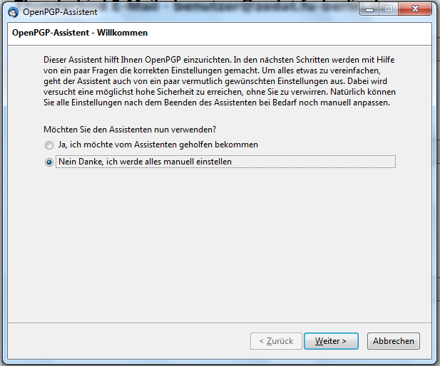
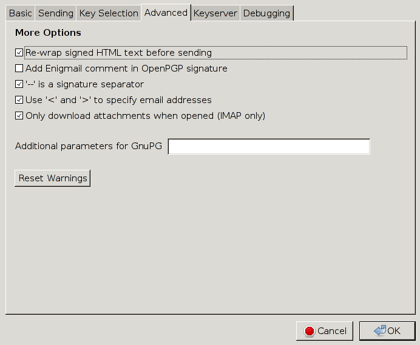
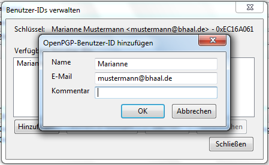
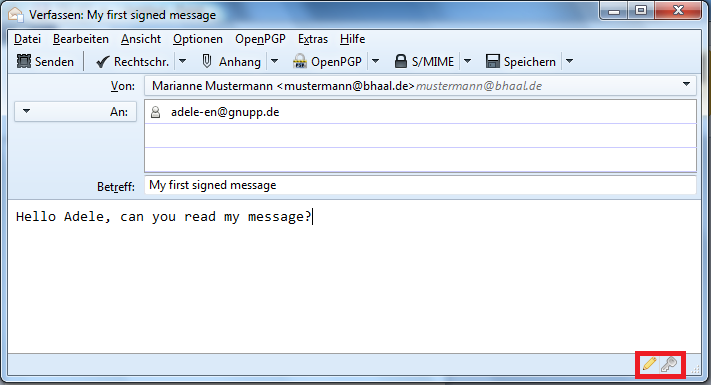

Email-Verschlüsselung mit GPG
=============================

Dieses Tutorial wird erklären wie und warum) man Emails mit GPG (=GNU Privacy Guard,
eine freie Implementation von PGP=Pretty Good Privacy) verschlüsseln kann und
sollte.

PGP ist wohl die ausgereifteste Lösung zur sicheren Kommunikation per Email und
auf allen gängigen Plattformen (GNU/Linux, Windows, Mac OS X, Android, iOS, ...),
wenn auch vielleicht mit ein paar Haken auf die wir entsprechend hinweisen werde,
verfügbar.

Die Benutzung von GPG ist vorallem wenn man damit anfängt etwas obskur, weswegen
ich hoffe mit diesem Tutorial etwas Licht ins Dunkel zu bringen.

Im Folgenden werden PGP und GPG gleichwertig benutzt.

Alle Änderungwünsche und Vorschläge sende man mir per Email an [mich](mailto:behrmann@physik.fu-berlin.de).

# Warum Krypto?

## Warum eigentlich Krypto? Wer kann schon meine Mails lesen?

Dummerweise, jeder der sich auch nur ein bisschen bemüht. Emails sind nicht die
technische Fortführung des Briefes, für die man sie instinktiv hält, sondern
die der Postkarte.
Genau wie bei Postkarten, kann eine Email jeder lesen, bei dem sie vorbeikommt.
Das ist auch kein hypothetisches Angriffsszenario, das ist das Geschäftsmodell
von GMail, GMX, Yahoo und allen anderen Freemailern. Der Inhalt aller ein- und
ausgehenden Mails wird analysiert und daraus ein Profil der Nutzer erstellt, so
dass Werbung zielgerichteter geschaltet werden kann.

## Moment, meinen Webmailer besuche ich doch per HTTPS und auch in meinem Mailprogramm habe ich SSL/TLS eingeschaltet.

Sehr gut, nur leider ist das nur ein Tropfen auf den heißen Stein. Erstmal
bedeutet das nur, dass die Kommunikation zwischen dir und deinem Mailserver
verschlüsselt ist, über die Kommunikation zwischen den Mailserver verschiedener
Anbieter sagt das leider erstmal nichts aus; diese war bis vor kurzem meist
unverschlüsselt und das hebelt die Verschlüsselung insgesamt aus, da diese immer
nur so stark ist, wie ihr schwächstes Glied.

Auch schützt einen SSL/TLS nicht vor Fehlern in dessen Implementierung, wie
jüngst Heartbleed zeigte, oder seinem Design, z.B. kann prinzipiell jede CA
(Certificate Authority) für jeden Host ein SSL-Zertifikat ausstellen.
SSL hat zu viele mögliche Angriffe gegen sich, um sie hier aufzuzählen, nicht
zuletzt, dass zumindest bei nicht selbst betriebenen Mailservern immer staatliche
Stellen die Herausgabe der Schlüssel verlangen können.

Zwar gibt es Lösungsansätze für all diese Probleme: Perfect Forward Secrecy
ermöglicht, dass erbeutete SSL-Schlüssel nicht dazu genutzt werden können
zurückliegenden Datenverkehr zu entschlüsseln, DANE löst das Probleme, das einem
falsche Schlüssel untergeschoben werden, allerdings werden diese Lösungen noch
nicht überall unterstützt, DANE z.B. erst von einem *einzigen* Mailprovider
überhaupt (Posteo).

Selbst wenn man selbst oder der eigene Mailanbieter das Minenfeld SSL sicher
durchschifft hat, bleibt das Problem, dass SSL die Daten nur im Transit schützt,
nicht aber, wenn sie einmal auf dem Server liegen. Dort kann die Mail jeder lesen,
der Anbieter und seine Admins und jeder sonst, der Zugang zu den Mailservern hat,
z.B. Techniker im Datacenter.

PGP löst diese Problem auf allen Ebenen, da nur der Besitzer des richtigen Schlüssels
eine Mail entschlüsseln kann.

## Und selbst wenn, ich habe doch nichts zu verbergen.

Diesen Satz höre ich immer wieder und er könnte kaum falscher sein: Jeder hat Dinge
zu verbergen.

Schlussendlich ist es nichteinmal notwendig, dass man selbst etwas zu verbergen
hat. Die Enthüllungen Edward Snowdens haben gezeigt, dass die NSA die Verbindungen
zwischen Menschen bis in eine Tiefe von 3 untersucht, das bedeutet:

> A kennt B kennt C kennt D

Folglich kann auf A zurückfallen, dass er jemanden kennt, der jemanden kennt, der
jemanden kennt, der verdächtig ist. Kennst du alle Freunde von Freunden deiner
Freunde? Kannst du für alles Einstehen, was sie sagen, tun und denken?
Unwahrscheinlich, wenn man bedenkt, dass der soziale Graph für die gesamte
Menschhehit nur einen Durchmesser von 5 oder 6 haben soll, also nur noch zwei
oder drei Verbindungen mehr.

## Sonst noch was?

Außer zur Verschlüsselung, erfüllt PGP noch einen anderen Hauptnutzen: Authentifizierung.

Woher weis ich eigentlich, das Mails von meinem Kumpel auch von ihm kommen, oder
wichtiger, Mails von meiner Bank?

Ich weis es nicht (so lange die Mails nicht signiert sind), da Absender von Mails
trivial zu fälschen sind. Warum? Mails sind einfache Textdateien, der Absender
ist einfach ein Eintrag
```
From: user@host.com
```
Würde ich eine Mail fälschen wollen, dann könnte ich ganz einfach irgendetwas
in das From-Feld eintragen.

Dieses Problem wird durch digitale Signaturen gelöst. Dabei wird eine Zusammenfassung
(Digest) an die Mail angehangen, der vom Sender mit seinem Schlüssel verschlüsselt
ist, und der vom Empfänger entschlüsselt und gegen einen selbstangefertigten
Digest verglichen werden kann. Sind beide Digests gleich, weis man, dass die Mail
nicht manipuliert wurde und von demjenigen geschickt worden sein muss, der den
Schlüssel besitzt mit dessen Hilfe der Digest erstellt wurde.

## Und wo ist der Haken?

## Ein paar Worte dazu wie Krypto funktioniert

# Mein erster Tag mit GPG

Im Folgenden gehen wir gemeinsam reich bebildert durch die Instllation und
Konfiguration von Thunderbird und GPG. Da (leider) die meisten Leute Windows
benutzen, habe ich ein aktuelles Windows 7 als Beispielsystem genommen auf das
ich das aktuelle [Thunderbird 24.5.0](https://www.mozilla.org/en-US/thunderbird/)
installiert habe. Für unser eigentliches Ziel, die Email-Krypto mit PGP, kommt
dazu noch [GPG4Win](http://www.gpg4win.org/) und [Enigmail](https://www.enigmail.net/home/index.php).

Unter allen gängigen Linux-Distributionen ist alles etwas einfacher, da man im
Zweifel nur Thunderbird installieren muss, da alle großen Distributionen GPG
schon in der Form von [GNUPG](https://www.gnupg.org/) mitbringen.

Unter Mac OS X ist eigentlich auch alles mehr oder weniger einfach, dort ist
die GPG Suite die man haben möchte [GPGTools](https://gpgtools.org/). Allerdings
sind meine Aussagen zu Mac OS mit Vorsicht zu genießen, da ich keinen Mac habe
um sie zu testen, folglich übernehme ich, wie auch für alle anderen Aussagen,
keine Gewähr.

Ich werde das Tutorial für eine fiktive Nutzerin mit dem Namen Marianne Mustermann
schreiben und einmal durch alle wichtigen Einstellungen von Thunderbird gehen.

## Thunderbird installieren und konfigurieren

Als erstes installieren wir [Thunderbird](https://www.mozilla.org/en-US/thunderbird/).
Beim ersten öffnen, solltet ungefähr soetwas sehen:


Da ihr von eurer Uni eine funktionierende Mailadresse bekommen habt oder schon eine
habt, ist "Überspringen und meine existierende E-Mail-Adresse verwenden" die
richtige Wahl.

Das führt euch zum folgenden Fenster:


In diesem Fenster könnte ihr euren Namen und eure Mailadresse eintragen, sowie
das Passwort für den Mailsever, wenn ihr wollte, könnt ihr euer Passwort auch
sprechen.

Aus dem Hostname der Mailadresse kann Thunderbird die Einstellungen des Mailserver
bestimmen, für den Fall, dass die Einstellungen eures Mailservers nicht in
Thunderbirds Datenbank sind, könnt ihr Protokoll (IMAP oder POP3 für den
Posteingangsserver), Hostname von IMAP- und SMTP-Server, ihre Ports, die SSL-Einstellungen
und die Art der Authentifizierung sowie euren Usernamen für den Mailserver
einstellen

Hier eine Liste von Beispieleinstellungen für ein paar Unis, für den unwahrscheinlichen
Fall, dass eure Uni nicht in der Datenbank von Thunderbird ist:

Uni | Anleitung
----|----------
FU Berlin | http://www.zedat.fu-berlin.de/tip4u_91.pdf
HU Berlin | http://www.cms.hu-berlin.de/dl/kommunikation/email/clients/Thunderbird301/
TU Berlin | https://www.tubit.tu-berlin.de/menue/dienste/kommunikation_internet/e-mail/der_e-mail_service/daten_und_anleitungen/einrichtung_in_thunderbird/
KIT       | https://www.scc.kit.edu/dienste/7395.php
LMU München | http://www.en.it.physik.uni-muenchen.de/dienste/kommunikation/e-mail/einrichtung_clients/index.html
TU München  | https://portal.mytum.de/faq/it-dienste/email2/imap
Universität Potsdam | http://www.zeik.uni-potsdam.de/internet/mail.html

Ein Kommentar zu den Einstellungen: IMAP ist auf jeden Fall vor POP3 zu bevorzugen.
Bei IMAP liegen eure Mails dauerhaft auf dem Mailserver, mit POP3 werden sie vom,
Mailserver heruntergeladen und verschwinden von dort.

Beides hat Vor- und Nachteile. Zwar liegen bei IMAP eure Mails auf einem Server,
aber dafür liegen eure Mails auf einem Server. Das ist nicht nur ein gutes Backup,
sondern ermöglicht auch eure Mails zwischen mehreren Clients synchron zu halten
und Smartphones und Tablets sei Dank hat heute jeder mehrere Clients.

Viel wichtiger ist jedoch, dass POP3 nur für einseitge Kommunikation von Server
zu Client gedacht ist, dadurch kann es zu mehrmaligen Herunterladen von Mails oder
dem Verlust von Mails kommen. IMAP hingegen ist für Zwei-Wege-Kommunikation zwischen
Server und Clients und hält den Zustand aller Mails und Ordner in eurer Mailbox
synchron.

Bei der Authentifizierung gibt es viel Auswahl, aber "Automatisch erkennen" oder
"Normales Passwort" ist die beste Wahl, vorausgesetzt dass ihr SSL eingeschaltet
habt, was ihr *unbedingt* tun solltet, dabei ist STARTTLS SSL/TLS falls möglich
vorzuziehen, da STARTTLS explizit TLS als Transportverschlüsselung verlangt und
SSL/TLS auch SSL nehmen könnte. Warum ist das wichtig? TLS ist die spätere Version
des SSL-Protokolls und sicherer. Warum ist "Normales Passwort" sicher, warum nicht
"Verschlüsselts Passwort"? Ganz einfach, mit Hilfe von TLS ist die übertragung des
Paswortes schon verschlüsselt, während die Übertragung eines verschlüsselten Passwortes
für den früher normalen Fall von unverschlüsselten Verbindungen zwischen Mailserver
und Client gedacht war.

Das Fenster zur Konteneinrichtung ist leider etwas buggy. Zwar kann man die Ports
zwischen ein paar Voreinstellungen wechseln, leider ist die Transportverschlüsselung
immer fest an den Port gebunden, was in der Realität natürlich nicht so sein muss.
Auch kann man die auf "Erweiterte Einstellungen" was einen direkt zu den Konteneinstellungen
bringt wo man unter "Server-Einstellungen" und "Postausgang-Server (SMTP)" alles
von Hand einstellen kann, erst klicken, nachdem man wirklich alle Felder in diesem
Fenster von Hand verändert hat.

Wenn ihr im Konteneinrichtungsfenster alles eingegeben habt, dann habt ihr es geschafft und
Thunderbird so weit eingerichtet, das ihr es benutzen könnt. Ihr solltet jetzt
folgendes sehen können (zumindest wenn ihr Alt drückt um die Menüleiste anzuzeigen).


Falls ihr das obere Fenster so nicht sehen könnt, dann müsst ihr auf das entsprechende
Mailkonto klicken, was in obigen Bild rot eingerahmt ist.

Als nächstes wollen wir die wichtigsten Optionen von Thunderbird bearbeiten.
Leider sind diese über die Konten-Einstellungen und die globalen Einstellungen
von Thunderbird verstreut. Wir werden mit den Konteneinstellungen anfangen, diese
sind im obigen Bild grün eingerahmt.

Als erstes solltet ihr die Startseite der Konten-Einstellungen sehen.


Hier könnt ihr sowohl den Namen als auch die E-Mail-Adresse des Kontos ändern oder
eine Signatur hinzufügen. Außerdem könnt ihr hier im rot eingerahmten Feld weitere
Identitäten einfügen, die ihr dann als Absender für eure Mails benutzen könnt.


Wir bearbeiten einfach mal die beispielhaft die Default-Identität, die beim Einrichten
von Thunderbird erstellt wurde:


Während die Konteneinstellungen die "globalen" Einstellungen des Kontos beinhaltet,
kann man diese Einstellungen benutzen um für jeden einzelen Alias spezifische Einstellungen
für Namen und Emailadresse zu machen und am aller wichtigsten für das
"Verfassen & Adressieren" (rot eingerahmt):


Das ist der richtige Moment um etwas über Mail-Etiquette zu reden:

1. Schaltet HTML-Mails aus (rot eingerahmt). HTML-Mails sind eine furchtbare Pest
   und seid ehrlich, wann habt ihr das letzte Mal den Font eurer Mail geändert
   oder den Text in Regenbogenfarben gestaltet? Nie? Richtig.
   Dafür erschwert HTML die Anzeige auf einfachen textbasierten Clients und
   macht die Verschlüsselung mittels GPG schwieriger.
   Solltet ihr jemals HTML-Mails versenden wollen, dann kann man sie einfach durch
   das Drücken von Shift beim Anklicken von "Verfassen" für die gerade aktuelle Mail
   anschalten.

2. Antworten auf Mails beginnt man überlicherweise *über* zitierten Texten (blau
   eingerahmt). Niemand möchte bei jeder Mail ganz nach unten scrollen müssen.

Die selben Einstellungen kann man auch nochmal für alle Aliase eines Kontos unter
"Verfassen & Adressieren" in den Konteneinstellungen machen:


Von hier aus gehen wir direkt in die globalen Einstellungen (grün eingerahmt):


Hierher kommt man alternativ auch über das Menü über Extras -> Einstellungen.
Wir interessieren uns vornehmlich für die Reiter "Verfassen" und "Sicherheit",
rot und grün eingerahmt. Fangen wir mit der Sicherheit an:


Als erstes sollte man ein Master-Passwort setzen, da Thunderbird ansonsten alle
Passwörter im Klartext speichert und bei einem einfachen Klick auf das Feld
"Gespeicherte Passwörter" anzeigt.

Unter "Verfassen" finden wir folgendes:


Die "Sende-Optionen" sind was uns interessiert. Dort kann man sehr kleinteilig
einstellen an welche Adressen man HTML- und an welche man Reintext-Mails schicken
möchte.


Da wir natürlich nur Reintext-Mails schicken wollen, setzen wir dort über hinzufügen
die Expression \*.\* als Wildcard um alle Namen für Domains auf einmal zu erfassen.
Natürlich gilt immer die oben genannte Ausnahme (Shift beim Klicken von Verfassen)
falls man doch wirklich mal eine HTML-Mail verschicken wollen sollte.

Jetzt haben wir es geschafft. Wir sind mit den grundlegenden Einstellungen von
Thunderbird fertig.

# Krypto!

## GPG installieren und Vorbereitungen

Um jetzt zur Krypto zu kommen, müssen wir erstmal GPG installieren. Unter Windows
läd man sich dafür [GPG4Win](http://www.gpg4win.org/) herunter und installiert es.
Unter Linux ist das ganze etwas einfacher, denn GPG wird von allen großen Distribution
zur Signierung ihrer Pakete verwendet und ist deswegen schon installiert.
Unter Mac OS X muss man zu [GPGTools](https://gpgtools.org/) greifen.

Nachdem wir GPG4Win (oder Äquivalent) installiert haben, installieren wir nun Enigmail.
Enigmail ist das Addon das Thunderbird als Wrapper für GPG benutzt. Dafür gehen
wir unter Extras im Hauptmenü in das Add-on Menü und suchen nach Enigmail,
installieren es und starten anschließen Thunderbird neu.


Nach dem Neustart sollte dieses Fenster aufpoppen:



Dieser kann eigentlich alle Einstellungen zu machen, die wir gleich machen wollen
leider hatte er (zumindest in der Vergangenheit) ein paar Beschränkungen, z.B.
in der Schlüssellänge, so dass wir lieber alles von Hand machen, was auch den
Vorteil hat, dass wir die Einstellungen kennenlernen.

Wenn ihr nun Alt drückt, dann seht ihr, dass ein neues Menu zu den bisherigen
hinzugekommen ist:


Über das OpenPGP-Menu oben findet ihr die OpenPGP-Einstellungen:


Die Einstellungen sind aber offensichtlich etwas leer, weswegen wir erstmal die
restlichen Einstellungen anschalten (rot eingerahmt), dadurch kommen einige
Reiter dazu:


Auf diesem Reiter ist die Zeit für die Speicherung der Passphrase am inetessantesten.
Was ist die Passphrase eigentlich? Wenn wir nachher einen Schlüssel erstellen,
dann werden wir ihn mit einer Passphrase sichern, damit unser Schlüssel auch nur
von uns benutzt werden kann. Die Passphrase muss man dann für jedes Senden oder
Entschlüsseln einer Mail neu eingeben, da das aber etwas unkomfortabel sein kann,
kann man die Passphrase für ein paar Minuten zwischenspeichern; gute Werte dafür
sind alles zwischen einer und fünf Minuten.

So, gehen wir zum nächsten Reiter "Senden":


Was wir hier sehen, sind die Standardeinstellungen, wichtig sind hier die beiden
eingerahmten Einstellungen.

Das rot eingerahmte bedeutet, dass immer wenn ihr eine verschlüsselte Mail
verschickt, der Text nicht nur fúr den Empfängerschlüssel, sondern auch für euren
eigenen verschlüsselt wird.

Wie wir oben schon genauer beschrieben haben, kann ein Text, der mit einem
öffentlichen Schlüssel verschlüsselt wurde, nur mit dem zugehörigen privaten
Schlüssel wieder entschlüsselt werden kann. Folglich könntet ihr nach der
Verschlüsselung ohne Nutzung dieser Option eure von euch selbst verschickten
Mails nicht mehr lesen können.

Die grüne Option dreht sich auch um Verschlüsselung. Wenn diese Option nicht gesetzt
ist, dann könnte ihr verschlüsselte Mails nur an andere PGP-Nutzer schicken, deren
Schlüsseln ihr vertraut, was bedeutet, dass ihr sie unterschrieben habt (mehr
dauz spẗer). Durch das Setzen dieser Option könnt ihr jemanden eine verschlüsselte
Mail schicken ohne vorher seinen Schlüssel zu signieren.

Der nächste Reiter dreht sich um die Auswahl von Schlüsseln:


Die Voreinstellung ist die beste Wahl, dadurch wird immer automatisch der passende
Schlüssel zu einer Mailadresse gewählt und alles lässt sich durch Empfängerregeln,
zu denen wir später noch mehr sagen, noch genauer einstellen.

Die erweiterten Einstellungen haben in der Standardeinstellung folgende Häkchen:



Die meisten Einstellungen sind relativ selbsterklärend.
Die ersten Option regelt das automatische signierte/verschlüsselte Antworten auf
signierte/verschlüsselte Mails, und die zweite fügt in alle Mails einen zusätzlichen
Header ein, der anzeigt, dass man Enigmail benutzt. Wenn man das möchte kann man
das getrost abschalten.

Zu guter letzt die Liste der Schlüssel-Server:


Wie findet man bei PGP eigentlich die Schlüssel anderer Leute, wenn man sie nicht
von ihnen bekommen hat? Man sucht auf einem Schlüsselserver. Schlüsselserver sind
soetwas wie ein Telefonbuch für PGP-Schlüssel. Wenn man nach einem Schlüssel sucht
dann hat man in Zukunft die Auswahl zwischen allen Server in dieser Liste.

Der wichtigste Server ist `pool.sks-keyservers.net`. Dieser ist kein einzelner
Server, sondern ein Pool mehrer Server die alle Schlüssel zwischen sich austauschen,
wodurch sie insgesamt am aktuellsten sind. Ein weiterer großer Server, der auch
Teil des SKS-Pools ist, ist `pgp.mit.eud`.

So, nachdem wir nun durch die allgemeinen PGP-Einstellungen durch sind, kommen wir
zum interessante Teil des Abends: Wir machen uns einen Schlüssel und benutzen ihn.

## Schlüssel machen








## Mails signieren

## Mails verschlüsseln

# Vertrauen

## Web of Trust

## Keysigning

# Fortgeschrittenes

## Keysigningparties

# Übrige Fragen

**Schlüssellängen:** Ist *RSA1024* jetzt sicherer als *AES256*?

Das ist ein Vergleich von Äpfeln mit Birnen.
