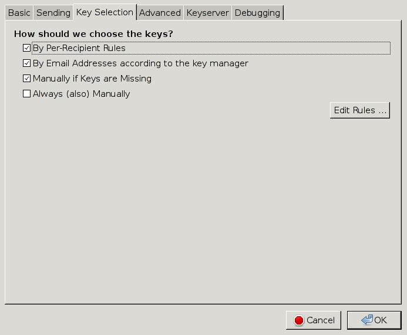
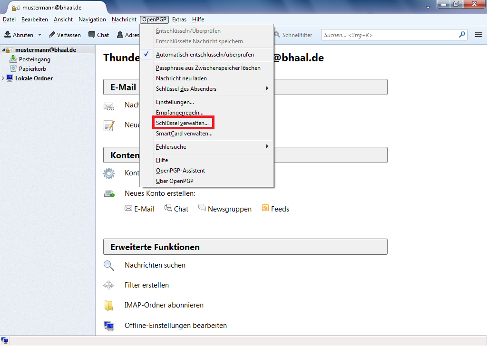
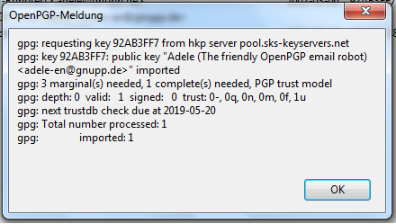

Email-Verschlüsselung mit GPG
=============================

Dieses Tutorial wird erklären wie und warum) man Emails mit GPG (=GNU Privacy Guard,
eine freie Implementation von PGP=Pretty Good Privacy) verschlüsseln kann und
sollte.

PGP ist wohl die ausgereifteste Lösung zur sicheren Kommunikation per Email und
auf allen gängigen Plattformen (GNU/Linux, Windows, Mac OS X, Android, iOS, ...),
wenn auch vielleicht mit ein paar Haken auf die wir entsprechend hinweisen werde,
verfügbar.

Die Benutzung von GPG ist vorallem wenn man damit anfängt etwas obskur, weswegen
ich hoffe mit diesem Tutorial etwas Licht ins Dunkel zu bringen.

Im Folgenden werden PGP und GPG gleichwertig benutzt.

Alle Änderungwünsche und Vorschläge sende man mir per Email an [mich](mailto:behrmann@physik.fu-berlin.de).

# Warum Krypto?

## Warum eigentlich Krypto? Wer kann schon meine Mails lesen?

Dummerweise, jeder der sich auch nur ein bisschen bemüht. Emails sind nicht die
technische Fortführung des Briefes, für die man sie instinktiv hält, sondern
die der Postkarte.
Genau wie bei Postkarten, kann eine Email jeder lesen, bei dem sie vorbeikommt.
Das ist auch kein hypothetisches Angriffsszenario, das ist das Geschäftsmodell
von GMail, GMX, Yahoo und allen anderen Freemailern. Der Inhalt aller ein- und
ausgehenden Mails wird analysiert und daraus ein Profil der Nutzer erstellt, so
dass Werbung zielgerichteter geschaltet werden kann.

## Moment, meinen Webmailer besuche ich doch per HTTPS und auch in meinem Mailprogramm habe ich SSL/TLS eingeschaltet.

Sehr gut, nur leider ist das nur ein Tropfen auf den heißen Stein. Erstmal
bedeutet das nur, dass die Kommunikation zwischen dir und deinem Mailserver
verschlüsselt ist, über die Kommunikation zwischen den Mailserver verschiedener
Anbieter sagt das leider erstmal nichts aus; diese war bis vor kurzem meist
unverschlüsselt und das hebelt die Verschlüsselung insgesamt aus, da diese immer
nur so stark ist, wie ihr schwächstes Glied.

Auch schützt einen SSL/TLS nicht vor Fehlern in dessen Implementierung, wie
jüngst Heartbleed zeigte, oder seinem Design, z.B. kann prinzipiell jede CA
(Certificate Authority) für jeden Host ein SSL-Zertifikat ausstellen.
SSL hat zu viele mögliche Angriffe gegen sich, um sie hier aufzuzählen, nicht
zuletzt, dass zumindest bei nicht selbst betriebenen Mailservern immer staatliche
Stellen die Herausgabe der Schlüssel verlangen können.

Zwar gibt es Lösungsansätze für all diese Probleme: Perfect Forward Secrecy
ermöglicht, dass erbeutete SSL-Schlüssel nicht dazu genutzt werden können
zurückliegenden Datenverkehr zu entschlüsseln, DANE löst das Probleme, das einem
falsche Schlüssel untergeschoben werden, allerdings werden diese Lösungen noch
nicht überall unterstützt, DANE z.B. erst von einem *einzigen* Mailprovider
überhaupt (Posteo).

Selbst wenn man selbst oder der eigene Mailanbieter das Minenfeld SSL sicher
durchschifft hat, bleibt das Problem, dass SSL die Daten nur im Transit schützt,
nicht aber, wenn sie einmal auf dem Server liegen. Dort kann die Mail jeder lesen,
der Anbieter und seine Admins und jeder sonst, der Zugang zu den Mailservern hat,
z.B. Techniker im Datacenter.

PGP löst diese Problem auf allen Ebenen, da nur der Besitzer des richtigen Schlüssels
eine Mail entschlüsseln kann.

## Und selbst wenn, ich habe doch nichts zu verbergen.

Diesen Satz höre ich immer wieder und er könnte kaum falscher sein: Jeder hat Dinge
zu verbergen.

Schlussendlich ist es nichteinmal notwendig, dass man selbst etwas zu verbergen
hat. Die Enthüllungen Edward Snowdens haben gezeigt, dass die NSA die Verbindungen
zwischen Menschen bis in eine Tiefe von 3 untersucht, das bedeutet:

> A kennt B kennt C kennt D

Folglich kann auf A zurückfallen, dass er jemanden kennt, der jemanden kennt, der
jemanden kennt, der verdächtig ist. Kennst du alle Freunde von Freunden deiner
Freunde? Kannst du für alles Einstehen, was sie sagen, tun und denken?
Unwahrscheinlich, wenn man bedenkt, dass der soziale Graph für die gesamte
Menschhehit nur einen Durchmesser von 5 oder 6 haben soll, also nur noch zwei
oder drei Verbindungen mehr.

## Sonst noch was?

Außer zur Verschlüsselung, erfüllt PGP noch einen anderen Hauptnutzen: Authentifizierung.

Woher weis ich eigentlich, das Mails von meinem Kumpel auch von ihm kommen, oder
wichtiger, Mails von meiner Bank?

Ich weis es nicht (so lange die Mails nicht signiert sind), da Absender von Mails
trivial zu fälschen sind. Warum? Mails sind einfache Textdateien, der Absender
ist einfach ein Eintrag
```
From: user@host.com
```
Würde ich eine Mail fälschen wollen, dann könnte ich ganz einfach irgendetwas
in das From-Feld eintragen.

Dieses Problem wird durch digitale Signaturen gelöst. Dabei wird eine Zusammenfassung
(Digest) an die Mail angehangen, der vom Sender mit seinem Schlüssel verschlüsselt
ist, und der vom Empfänger entschlüsselt und gegen einen selbstangefertigten
Digest verglichen werden kann. Sind beide Digests gleich, weis man, dass die Mail
nicht manipuliert wurde und von demjenigen geschickt worden sein muss, der den
Schlüssel besitzt mit dessen Hilfe der Digest erstellt wurde.

## Und wo ist der Haken?

## Ein paar Worte dazu wie Krypto funktioniert

# Mein erster Tag mit GPG

Im Folgenden gehen wir gemeinsam reich bebildert durch die Instllation und
Konfiguration von Thunderbird und GPG. Da (leider) die meisten Leute Windows
benutzen, habe ich ein aktuelles Windows 7 als Beispielsystem genommen auf das
ich das aktuelle [Thunderbird 24.5.0](https://www.mozilla.org/en-US/thunderbird/)
installiert habe. Für unser eigentliches Ziel, die Email-Krypto mit PGP, kommt
dazu noch [GPG4Win](http://www.gpg4win.org/) und [Enigmail](https://www.enigmail.net/home/index.php).

Unter allen gängigen Linux-Distributionen ist alles etwas einfacher, da man im
Zweifel nur Thunderbird installieren muss, da alle großen Distributionen GPG
schon in der Form von [GNUPG](https://www.gnupg.org/) mitbringen.

Unter Mac OS X ist eigentlich auch alles mehr oder weniger einfach, dort ist
die GPG Suite die man haben möchte [GPGTools](https://gpgtools.org/). Allerdings
sind meine Aussagen zu Mac OS mit Vorsicht zu genießen, da ich keinen Mac habe
um sie zu testen, folglich übernehme ich, wie auch für alle anderen Aussagen,
keine Gewähr.

## Thunderbird installieren und konfigurieren

Uni | Anleitung
----|----------
FU Berlin | http://www.zedat.fu-berlin.de/tip4u_91.pdf
HU Berlin | http://www.cms.hu-berlin.de/dl/kommunikation/email/clients/Thunderbird301/
TU Berlin | https://www.tubit.tu-berlin.de/menue/dienste/kommunikation_internet/e-mail/der_e-mail_service/daten_und_anleitungen/einrichtung_in_thunderbird/
KIT       | https://www.scc.kit.edu/dienste/7395.php
LMU München | http://www.en.it.physik.uni-muenchen.de/dienste/kommunikation/e-mail/einrichtung_clients/index.html
TU München  | https://portal.mytum.de/faq/it-dienste/email2/imap
Universität Potsdam | http://www.zeik.uni-potsdam.de/internet/mail.html











# Krypto!

## GPG installieren

Um jetzt zur Krypto zu kommen, müssen wir erstmal GPG installieren. Unter Windows
läd man sich dafür [GPG4Win](http://www.gpg4win.org/) herunter und installiert es.
Unter Linux ist das ganze etwas einfacher, denn GPG wird von allen großen Distribution
zur Signierung ihrer Pakete verwendet und ist deswegen schon installiert.
Unter Mac OS X muss man zu [GPGTools](https://gpgtools.org/) greifen.

## Schlüssel machen

## Mails signieren

## Mails verschlüsseln

# Vertrauen

## Web of Trust

## Keysigning

# Fortgeschrittenes

## Keysigningparties

# Übrige Fragen

**Schlüssellängen:** Ist *RSA1024* jetzt sicherer als *AES256*?

Das ist ein Vergleich von Äpfeln mit Birnen.
